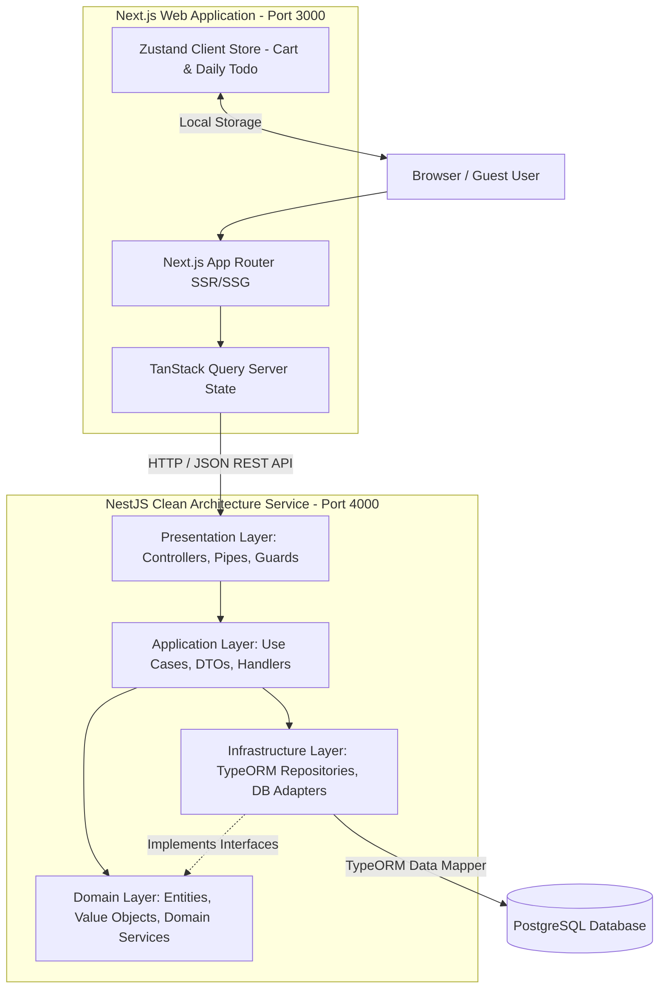

# TECHNICAL ARCHITECTURE — GREENPANTRY

- **Dự án**: GreenPantry Platform
- **Tác giả**: Senior Solution Architect & Senior Full-stack TypeScript Lead
- **Phiên bản**: 1.0.0
- **Trạng thái**: Draft approved for Design First phase

---

## 1. ARCHITECTURE OVERVIEW

GreenPantry được thiết kế theo mô hình **Single Repository** với sự phân tách tuyệt đối giữa **Frontend Web Application (Next.js)** và **Backend RESTful API Service (NestJS)**.

Hệ thống tuân thủ nguyên lý **Clean Architecture** (Domain-Driven Design), trong đó toàn bộ Business Rules thuộc Tầng Domain được cô lập hoàn toàn, không phụ thuộc vào Framework (NestJS/Express), Database ORM (TypeORM) hay giao thức truyền thông (HTTP REST).



---

## 2. TECHNOLOGY STACK

### 2.1. Frontend Stack
* **Framework**: Next.js 14+ (App Router, Server Actions nếu cần)
* **Language**: TypeScript 5.x (Strict Type Checking)
* **Styling**: Vanilla Tailwind CSS + CSS Modules cho micro-animations
* **Server State & Caching**: TanStack Query v5 (React Query)
* **Client State**: Zustand v4 (Persist middleware cho Cart & Daily Todo)
* **Form & Validation**: React Hook Form + Zod Schema Validation

### 2.2. Backend Stack
* **Framework**: NestJS v10+ (Node.js LTS)
* **Architecture Pattern**: Clean Architecture / Hexagonal Architecture
* **ORM**: TypeORM v0.3+ (Sử dụng Data Mapper Pattern)
* **Database**: PostgreSQL 15+
* **Validation**: class-validator & class-transformer
* **Documentation**: Swagger / OpenAPI 3.0

---

## 3. CLEAN ARCHITECTURE LAYERS

Backend NestJS được phân tầng nghiêm ngặt như sau:

```text
apps/api/src/
│
├── domain/                  <-- Pure TS code (No NestJS/TypeORM dependencies)
│   ├── entities/            (Product, Order, BlogPost, Question, Review)
│   ├── value-objects/       (Price, Email, PhoneNumber, TaskDate)
│   ├── enums/               (OrderStatus, ReviewStatus, QuestionStatus)
│   └── repositories/        (IProductRepository, IOrderRepository Interfaces)
│
├── application/             <-- Business Logic Orchestration
│   ├── use-cases/           (CreateOrderUseCase, GetNewProductsUseCase)
│   ├── dto/                 (CreateOrderDto, TrackOrderDto)
│   └── interfaces/          (IPriceCalculatorService)
│
├── infrastructure/          <-- Data Persistence & External Libraries
│   ├── database/
│   │   ├── entities/        (ProductOrmEntity, OrderOrmEntity - TypeORM models)
│   │   ├── mappers/         (ProductMapper: ORM Entity <-> Domain Entity)
│   │   └── migrations/      (TypeORM SQL Migrations)
│   └── repositories/        (ProductTypeOrmRepository implements IProductRepository)
│
└── presentation/            <-- Web Controllers & HTTP Adapters
    ├── controllers/         (ProductController, OrderController)
    ├── filters/             (HttpExceptionFilter)
    └── pipes/               (ZodValidationPipe)
```

---

## 4. DOMAIN BOUNDARIES

System bao gồm 6 Sub-Domains độc lập:

1. **Catalog Domain**: Quản lý Sản phẩm (`Product`), Album ảnh, Danh mục (`Category`), Logic Sản Phẩm Mới (Hybrid Rule).
2. **Commerce Domain**: Quản lý Giỏ hàng (`Cart` - Client validation & Server recalculation), Đơn hàng (`Order`), Chi tiết đơn (`OrderItem`), Đánh giá sản phẩm đã xác thực (`Review`).
3. **Content Domain**: Quản lý Bài viết (`BlogPost`), Danh mục Blog, Thẻ bài viết (`BlogTag`), và liên kết Content-Commerce (`BlogPostProduct`).
4. **Community Domain**: Quản lý Hỏi đáp (`Question`, `QuestionAnswer`) và luồng duyệt nội dung (Moderation).
5. **Personal Domain**: Quản lý Daily Todo (`Todo`) phân tách theo `TaskDate` hoàn toàn tại Client Side.
6. **Customer & Loyalty Domain**: Quản lý Tài khoản Khách hàng (`Customer`), Sổ địa chỉ (`CustomerAddress`), Tích điểm & Đổi điểm trừ trực tiếp (`CustomerPointTransaction`, quy tắc 10k = 1đ, 10đ = 1k, Opt-in).

---

## 5. DATABASE ERD (POSTGRESQL)

```mermaid
erdiagram
    categories ||--o{ products : contains
    products ||--o{ product_images : has
    products ||--o{ order_items : ordered_in
    orders ||--o{ order_items : includes
    products ||--o{ reviews : reviewed_by
    orders ||--o{ reviews : verifies

    customers ||--o{ customer_addresses : has
    customers ||--o{ orders : places
    customers ||--o{ customer_point_transactions : possesses
    orders ||--o{ customer_point_transactions : triggers
    
    blog_categories ||--o{ blog_posts : categorizes
    blog_posts ||--o{ blog_post_tags : tagged_with
    blog_tags ||--o{ blog_post_tags : tags
    blog_posts ||--o{ blog_post_products : links_to
    products ||--o{ blog_post_products : feature_in

    products ||--o{ questions : subject_of
    questions ||--o{ question_answers : answered_by

    customers {
        uuid id PK
        string full_name
        string phone UK
        string email UK
        string password_hash
        int loyalty_points
        boolean is_active
        timestamp created_at
        timestamp updated_at
    }

    customer_addresses {
        uuid id PK
        uuid customer_id FK
        string recipient_name
        string phone
        string province
        string district
        string ward
        string address_detail
        boolean is_default
        timestamp created_at
    }

    customer_point_transactions {
        uuid id PK
        uuid customer_id FK
        uuid order_id FK
        string transaction_type
        int points
        int balance_after
        string description
        timestamp created_at
    }

    categories {
        uuid id PK
        string name
        string slug UK
        string description
        string image_url
        boolean is_active
        timestamp created_at
    }

    products {
        uuid id PK
        uuid category_id FK
        string name
        string slug UK
        decimal price
        decimal compare_at_price
        int stock_quantity
        string weight_unit
        string origin
        text ingredients
        text nutrition_info
        text description
        boolean is_featured_new
        timestamp released_at
        timestamp created_at
    }

    orders {
        uuid id PK
        uuid customer_id FK
        string order_number UK
        string customer_name
        string customer_phone
        string customer_email
        string province
        string district
        string ward
        string address_detail
        decimal subtotal
        decimal shipping_fee
        int points_used
        decimal points_discount_amount
        int points_earned
        decimal total_amount
        string payment_method
        string status
        timestamp created_at
    }

    reviews {
        uuid id PK
        uuid product_id FK
        uuid order_id FK
        string customer_name
        int rating
        text comment
        json images
        string status
        timestamp created_at
    }

    blog_posts {
        uuid id PK
        uuid category_id FK
        string title
        string slug UK
        text excerpt
        text content
        string cover_image
        string author_name
        int reading_time_minutes
        boolean is_featured
        timestamp published_at
    }

    blog_post_products {
        uuid blog_post_id PK, FK
        uuid product_id PK, FK
    }

    questions {
        uuid id PK
        uuid product_id FK
        string author_name
        string author_email
        string question_type
        text content
        string status
        timestamp created_at
    }

    question_answers {
        uuid id PK
        uuid question_id FK
        string responder_name
        text content
        boolean is_official
        timestamp created_at
    }
```

---

## 6. API ARCHITECTURE & CONTRACTS

### 6.1. Standard REST Endpoints

#### Catalog API
* `GET /api/v1/products` — Lấy danh sách sản phẩm (Hỗ trợ Pagination `page`, `limit`, Lọc `category_id`, `min_price`, `max_price`, Sort `price_asc`, `newest`).
* `GET /api/v1/products/:slug` — Chi tiết sản phẩm.
* `GET /api/v1/products/new-arrivals` — Lấy danh sách sản phẩm mới (Hybrid Domain Rule: `released_at >= CURRENT_DATE - 30 days OR is_featured_new = true`).
* `GET /api/v1/categories` — Lấy danh sách danh mục.

#### Commerce API
* `POST /api/v1/orders` — Guest Checkout tạo đơn hàng mới.
  * *Request Body*:
    ```json
    {
      "customer_name": "Nguyen Van A",
      "customer_phone": "0912345678",
      "customer_email": "ana@example.com",
      "province": "Hà Nội",
      "district": "Cầu Giấy",
      "ward": "Dịch Vọng",
      "address_detail": "Số 10 Phạm Hùng",
      "items": [
        { "product_id": "uuid-1", "quantity": 2 }
      ]
    }
    ```
  * *Response 201 Created*: `order_number`, `total_amount`, `status: PENDING`.
* `GET /api/v1/orders/track` — Theo dõi đơn hàng bằng `order_number` và `phone`.
* `POST /api/v1/reviews` — Gửi đánh giá cho sản phẩm đã mua (Yêu cầu `order_number`, `phone`, `product_id`, `rating`, `comment`).

#### Content & Community API
* `GET /api/v1/blog/posts` — Danh sách bài viết blog.
* `GET /api/v1/blog/posts/:slug` — Chi tiết bài viết (Kèm danh sách `related_products`).
* `GET /api/v1/questions` — Danh sách Q&A đã duyệt (`APPROVED`).
* `POST /api/v1/questions` — Guest đặt câu hỏi mới (`status: PENDING`).

---

## 7. GUEST EXPERIENCE & DATA PERSISTENCE ARCHITECTURE

### 7.1. Guest Shopping Cart (Zustand + LocalStorage)
* Giỏ hàng được quản lý 100% tại Client State thông qua Zustand Store `cart-store.ts` kết hợp `persist` middleware (`key: 'greenpantry_cart'`).
* Khi Checkout, Frontend chỉ gửi danh sách `{ product_id, quantity }`. Backend tự thực hiện lại toàn bộ việc query giá từ DB, tính phụ phí shipping và stock khả dụng. **Tuyệt đối không tin tưởng giá tiền do Frontend truyền lên.**

### 7.2. Daily Personal Todo Architecture
* Quản lý 100% tại Client State bằng Zustand Store `todo-store.ts` (`key: 'greenpantry_todos'`).
* **Cấu trúc Store**:
  ```typescript
  interface TodoItem {
    id: string;
    title: string;
    description?: string;
    taskDate: string; // YYYY-MM-DD
    completed: boolean;
    completedAt?: string;
    createdAt: string;
  }
  ```
* Trang `/todo` kiểm tra ngày hiện tại (`format(new Date(), 'yyyy-MM-dd')`) để hiển thị danh sách công việc tương ứng. Khi chọn lại ngày cũ trên Date Picker, ứng dụng hiển thị các Task có `taskDate` tương ứng.

---

## 8. ARCHITECTURAL DECISION RECORDS (ADRS)

### ADR-01: Sử dụng TypeORM Data Mapper cho Backend Clean Architecture
* **Bối cảnh**: Cần lựa chọn ORM tương thích tốt với NestJS nhưng không làm vi phạm nguyên tắc Clean Architecture (Domain Layer độc lập với Database Framework).
* **Quyết định**: Chọn **TypeORM** sử dụng **Data Mapper Pattern** (tách rời `OrmEntity` và `DomainEntity`). Tầng Infrastructure thực hiện map dữ liệu qua lại giữa hai đối tượng này.
* **Hệ quả**: Giúp Domain Entity tinh khiết, dễ viết Unit Test độc lập.

### ADR-02: Single Repository thay vì Monorepo Turborepo cho MVP
* **Bối cảnh**: Đánh giá chi phí setup Monorepo complex vs tính đơn giản của dự án MVP.
* **Quyết định**: Sử dụng **Single Repository** với 2 thư mục độc lập `web/` (Next.js) và `api/` (NestJS).
* **Hệ quả**: Dễ vận hành, cài đặt CI/CD độc lập, giảm rủi ro xung đột cấu hình build tooling.

### ADR-03: Tách biệt hoàn toàn Todo Data tại Client Side cho Guest
* **Bối cảnh**: Guest không tạo tài khoản nhưng cần lưu giữ Todo qua nhiều ngày mà không làm rác Database Server.
* **Quyết định**: Lưu trữ Todo bằng `localStorage` Client-side.
* **Hệ quả**: 0% tải lên Database Server, phản hồi tức thì 0ms latency, bảo mật quyền riêng tư cá nhân của Guest.
